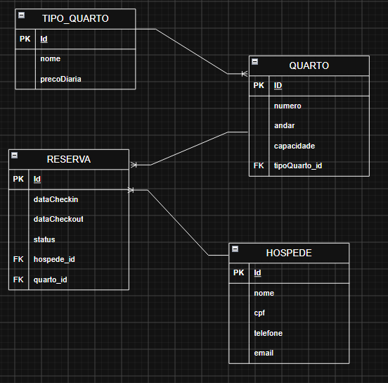

# Estudo de caso

# Atividade Pousada Recanto da Serra

## Diagrama:

Documentação da estrutura do banco de dados desenvolvida para o case da pousada. O foco do desenho é evitar dados repetidos e aumentar a consistência do sistema.

## Estrutura do Banco (Tabelas)

* **TipoQuarto**: Categoria do quarto como Standard, Luxo... Guarda o nome, a descrição e o preço da diária.
* **Quarto**: Estrutura física do quarto. Guarda o número, andar, capacidade e se conecta a um TipoQuarto.
* **Hospede**: Cadastro do cliente. Guarda o nome, CPF único primary key, telefone e e-mail.
* **Reserva**: Registra o vínculo entre um **Hospede** e um **Quarto**. Guarda as datas de check-in, check-out e o status.

## Regras e Meu Pensamento

* **Dinheiro Seguro**: Como o professor ensinou na última aula, valores tem que ser precisos, onde até mesmo diferença de centavos importa muito, nesse caso foi usado `BigDecimal` para preço da diária, com o objetivo de evitar erros de arredondamento.
* **Status Claros**: O status da reserva salva o texto exato (CONFIRMADA, CANCELADA, FINALIZADA) direto no banco.
* **Cadastro Único**: O CPF do hóspede é configurado como `unique` para impedir cadastros duplicados.
